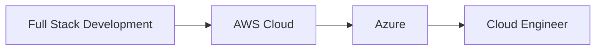

<div align="center">

# 👋 Hello, I'm Chamodi Lakshani


<p>

</p>

</div>

---

# 🌸 About Me

```ts
const chamodi = {
  location: "Sri Lanka 🇱🇰",
  education: "BSc (Hons) Health Information & Communication Technology",
  role: "Full Stack Developer",
  currentlyLearning: ["AWS", "Azure", "Docker"],
  interests: [
    "Cloud Computing",
    "Healthcare Technology",
    "Artificial Intelligence",
    "Web Development"
  ],
  motto: "Keep learning. Keep building. 🚀"
}
```

---

# 🌍 Current Focus

```text
🌱 Learning Cloud Computing

██████████░░░░░░░░░ 50%

☁ AWS
☁ Azure
🐳 Docker
```

---

# 💡 What I Enjoy Building

🏥 Healthcare Systems

🤖 AI Applications

🌐 Modern Web Applications

☁ Cloud-Based Solutions

📱 Responsive User Interfaces

---

# 🚀 Projects

<table>

<tr>
<td width="50%">

### 🏥 GovCare EHR

Electronic Health Record System

- React
- TypeScript
- Firebase

➡ Team Project

</td>

<td width="50%">

### 🤖 Dr Buddy

AI Medical Assistant

- Python
- Streamlit
- Kotlin

</td>
</tr>

<tr>
<td>

### 🎮 CodePlay

Interactive Coding Platform for Kids

- Next.js
- TypeScript

</td>

<td>

### 💼 Portfolio

Personal Portfolio Website

- React
- TypeScript

</td>
</tr>

<tr>
<td>

### 🌸 Zara Handmade

Business Website

- JavaScript
- MongoDB

</td>

<td>

### 🏢 Engineering Website

Corporate Website

- TypeScript

</td>
</tr>

</table>

---

# ⚡ Tech Stack

### Languages

<p align="center">


</p>

### Frontend

<p align="center">


</p>

### Backend

<p align="center">


</p>

### Database

<p align="center">


</p>

### Cloud & Tools

<p align="center">


</p>

---

# 🌱 Learning Path



---

# 📊 GitHub Analytics

<p align="center">


</p>

---

<p align="center">


</p>

---

# 📈 Contribution Graph

<p align="center">


</p>

---

<div align="center">

## 🌟 Beyond Coding

📚 Learning new technologies

🎨 UI/UX Design

🏥 Healthcare Innovation

☁ Exploring Cloud Computing

🤖 AI-powered Applications

</div>

---

<div align="center">

## 💬 Favorite Quote

> *"Every expert was once a beginner who kept building."*

⭐ Thanks for visiting my profile!

</div>
